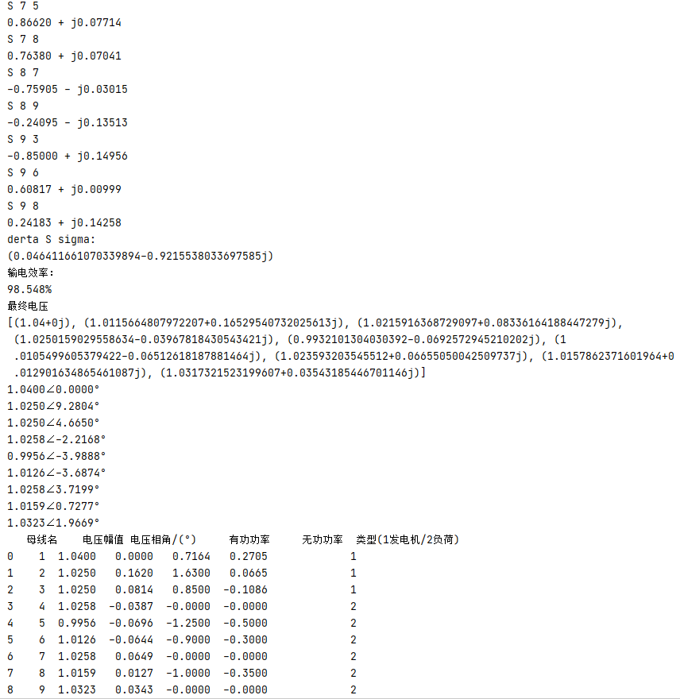

代码含2个py文件，**TideCal_Lib.py**、**TideCal_Final.py**。前者用于存放需要使用到的Python库、函数和类(自己写的)。后者使用前者的相应内容完成测试(这样以来后者的代码很少，看起来十分简洁)。

请在cmd使用

```
pip install XXX
```

命令，来安装电脑上缺失的库(它们可能包括**scipy**、**numpy**、**networkx**、**matplotlib**、**pandas**)。

将三机九节点的数据写入支路数据(**input-HW-branch**)、发电机数据(**input-HW-generator**)、系统潮流(**input-HW-tide**)三个txt文件。

运行**TideCal_Final.py**程序的代码(如下)。

```python
from TideCal_Lib import *

PowerSys=PowerSystem()
path1='input-HW-branch.txt'
path2='input-HW-generator.txt'
path3='input-HW-tide.txt'
PowerSys.init_fromsile(path1,path2,path3)
PowerSys.layout()
PowerSys.initialize()
PowerSys.iterate()
PowerSys.PowerCal()
PowerSys.ultraV()
PowerSys.result()
PowerSys.layout2()
```

程序将自动读入数据，生成导纳矩阵。输出如下：

- 控制台输出

  - 提示信息

  - 迭代过程中的雅可比矩阵值

  - 节点功率不平衡量

  - 节点电压修正量

  - 节点电压新值

  - 迭代次数(**Times**)

  - 平衡节点功率

  - 线路功率

  - 输电效率

  - 最终电压的直角坐标、极坐标表示

    <p align="right"> </p>
    
    

- 文件

  - 输出节点拓扑图形(**1 layout.png**)

  - 潮流分布的图形(**2 layout.png**)

  - 系统潮流(**系统潮流**)

    <p align="right"> </p>

     <p align="right"> </p>


<p align="right">张杰瑞  2019040401006 </p>

<p align="right">2021.11.30 </p>

